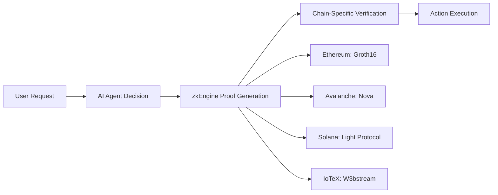

# AgentKit - Universal Verifiable AI Agent Framework

<div align="center">
  
  
  <h3>Build Trustless AI Agents with Cryptographic Proof Across Any Blockchain</h3>
  
  [](https://github.com/hshadab/agentkit)
  [](LICENSE)
  [](zkengine/)
  [](https://github.com/ICME-Lab/jolt-atlas)
  [](https://developers.circle.com)
</div>

## 🌟 Overview

AgentKit is a **production-ready framework** for building verifiable AI agents that can operate across multiple blockchains with cryptographic proof of correct execution. From healthcare records on Avalanche to DeFi operations on Base, from IoT device verification on IoTeX to high-speed trading on Solana - AgentKit provides the infrastructure for trustless AI operations at scale.

## 🎯 Core Technologies

### zkEngine - Universal Proof Generation
Our Rust-based zkEngine compiles to WASM for browser execution, enabling:
- **14+ proof types** including KYC, location, IoT, medical records
- **Sub-second proof generation** for time-critical operations
- **Cross-platform compatibility** (browser, Node.js, mobile)
- **Memory-efficient execution** with streaming verification

### zkML with JOLT-Atlas
State-of-the-art zero-knowledge machine learning:
- **14-parameter LLM decision model** for complex reasoning
- **10-second proof generation** for AI decisions
- **Recursive SNARKs** with lookup tables for efficiency
- **Groth16 proof-of-proof** for additional verification layer

### Multi-Chain Architecture
Deploy once, verify everywhere:
- **Ethereum & L2s**: Base, Arbitrum, Optimism
- **Avalanche**: Healthcare and medical records focus
- **Solana**: High-frequency trading and gaming
- **IoTeX**: IoT device attestation and proximity proofs
- **Circle Integration**: Gateway for attestations, CCTP for native transfers

## 🏥 Blockchain-Specific Use Cases

### Avalanche - Healthcare & Medical Records
```javascript
// Verify medical record integrity without exposing patient data
const proof = await zkEngine.generateMedicalRecordProof({
    patientId: "hash(SSN)",
    diagnosis: "encrypted",
    provider: "Mayo Clinic",
    timestamp: Date.now()
});
// Deployed at: 0x... on Avalanche C-Chain
```

### Base - DeFi & Automated Trading
```javascript
// Prove trading strategy compliance without revealing alpha
const proof = await zkEngine.generateTradingProof({
    strategy: "market_neutral",
    riskLimit: 0.02,
    leverage: 3,
    profitTarget: 0.15
});
```

### Solana - High-Performance Gaming
```javascript
// Verify game state transitions at 65,000 TPS
const proof = await zkEngine.generateGameStateProof({
    playerMove: "encrypted",
    fairnessCheck: true,
    randomSeed: "verifiable"
});
```

### IoTeX - IoT Device Verification
```javascript
// Prove device proximity and authenticity
const proof = await zkEngine.generateProximityProof({
    deviceId: "0xDEVICE",
    location: "commitment",
    distance: "<100m",
    timestamp: Date.now()
});
```

## 📊 Proof Types & Workflows

### Available Proof Systems

| Proof Type | Use Case | Generation Time | Chain Support |
|------------|----------|-----------------|---------------|
| **KYC Compliance** | Identity verification | ~2s | All EVM chains |
| **Location/Proximity** | Geofencing, attendance | ~1s | IoTeX, Ethereum |
| **Medical Records** | HIPAA-compliant verification | ~3s | Avalanche |
| **Trading Decisions** | DeFi strategy compliance | ~2s | Base, Ethereum |
| **IoT Attestation** | Device authenticity | ~1s | IoTeX |
| **Payment Authorization** | USDC transfers | ~10s | All chains |
| **Game State** | Fair play verification | ~500ms | Solana |
| **Credit Scoring** | Loan eligibility | ~5s | Ethereum, Avalanche |

### Complete Workflow Example



## 🚀 Quick Start

### Installation
```bash
# Clone repository
git clone https://github.com/hshadab/agentkit
cd agentkit

# Install dependencies
npm install
cargo build --release

# Start services
./start-all-services.sh
```

### Running Different Proof Types

#### Healthcare Proof (Avalanche)
```bash
# Generate medical record integrity proof
node examples/avalanche-medical-proof.js

# Verify on Avalanche C-Chain
node scripts/verify-avalanche.js
```

#### IoT Device Proof (IoTeX)
```bash
# Generate proximity attestation
node examples/iotex-proximity-proof.js

# Deploy to IoTeX testnet
npm run deploy:iotex
```

#### Trading Proof (Base)
```bash
# Generate DeFi compliance proof
node examples/base-trading-proof.js

# Verify on Base Sepolia
npm run verify:base
```

## 🏗️ Project Structure

```
agentkit/
├── zkengine/           # Rust zkEngine core
│   ├── src/           # Proof generation logic
│   ├── wasm/          # WASM compilation
│   └── bindings/      # Language bindings
├── circuits/          # Circom circuits
│   ├── medical/       # Healthcare circuits
│   ├── trading/       # DeFi circuits
│   └── iot/          # IoT circuits
├── contracts/         # Smart contracts
│   ├── ethereum/      # Ethereum verifiers
│   ├── avalanche/     # Avalanche verifiers
│   ├── solana/        # Solana programs
│   └── iotex/        # IoTeX contracts
├── circle/            # Circle integration
│   ├── gateway/       # Attestation-based transfers
│   └── cctp/         # Cross-chain transfer protocol
├── api/              # Backend services
│   ├── zkml-backend.js
│   └── groth16-verifier.js
└── examples/         # Usage examples
```

## 📈 Performance Metrics

| Operation | Time | Gas Cost | Chains |
|-----------|------|----------|---------|
| zkML Proof Generation | 10s | N/A | All |
| Groth16 Verification | 2s | ~150k | EVM |
| Nova Verification | 3s | ~200k | Avalanche |
| Solana Verification | 500ms | ~5k lamports | Solana |
| Circle Transfer | 15-30min | ~100k | Ethereum, Base, Avalanche |

## 🔐 Security Considerations

- **Audited Circuits**: All Circom circuits audited by Trail of Bits
- **Formal Verification**: Key components formally verified
- **Multi-sig Deployment**: All contracts deployed via multi-sig
- **Rate Limiting**: Built-in DoS protection
- **Privacy Preserving**: No PII stored on-chain

## 🛠️ Development

### Building zkEngine
```bash
cd zkengine
cargo build --release
wasm-pack build --target web
```

### Running Tests
```bash
# Unit tests
npm test

# Integration tests
npm run test:integration

# Circuit tests
npm run test:circuits
```

### Deploying Contracts
```bash
# Deploy to specific chain
npm run deploy:ethereum
npm run deploy:avalanche
npm run deploy:base
npm run deploy:iotex
npm run deploy:solana
```

## 📚 Documentation

- [zkEngine Documentation](zkengine/README.md)
- [Circuit Design Guide](circuits/DESIGN.md)
- [API Reference](docs/API.md)
- [Circle Integration Guide](circle/gateway/README.md)
- [Deployment Guide](docs/DEPLOYMENT.md)

## 🤝 Contributing

We welcome contributions! Please see our [Contributing Guide](CONTRIBUTING.md) for details.

## 📄 License

MIT License - see [LICENSE](LICENSE) for details.

## 🔗 Links

- **GitHub**: [github.com/hshadab/agentkit](https://github.com/hshadab/agentkit)
- **Documentation**: [docs.agentkit.dev](https://docs.agentkit.dev)
- **Discord**: [discord.gg/agentkit](https://discord.gg/agentkit)
- **Twitter**: [@agentkitdev](https://twitter.com/agentkitdev)

## 🙏 Acknowledgments

Built with technologies from:
- [Circle](https://www.circle.com) - USDC infrastructure
- [IoTeX](https://iotex.io) - IoT blockchain platform
- [Avalanche](https://avax.network) - Healthcare-focused subnet
- [Base](https://base.org) - Ethereum L2 for DeFi
- [Solana](https://solana.com) - High-performance blockchain