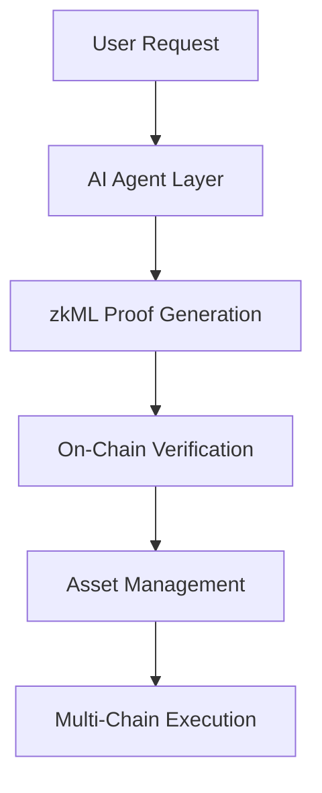

# AgentKit - Verifiable AI Agent System

<div align="center">
  
  
  <h3>Build Trustless AI Agents with Cryptographic Proof</h3>
  
  [](https://github.com/hshadab/agentkit)
  [](LICENSE)
  [](https://github.com/ICME-Lab/jolt-atlas)
  [](https://developers.circle.com)
</div>

## 🌟 Overview

AgentKit is a comprehensive framework for building **verifiable AI agents** that can autonomously manage digital assets with cryptographic proof of correct execution. It enables AI systems to make financial decisions that are trustless, transparent, and verifiable on-chain.

### Why AgentKit?

Traditional AI agents operate as black boxes - you trust them blindly. AgentKit changes this by providing:

- **Cryptographic proof** that AI decisions followed predefined rules
- **On-chain verification** of AI agent behavior
- **Multi-chain asset management** with built-in safety guarantees
- **Zero-knowledge proofs** preserving privacy while ensuring correctness

## 🚀 Key Capabilities

### 1. **Verifiable AI Decisions**
Prove that an AI agent correctly:
- Parsed user requests
- Applied authorization rules
- Made decisions with high confidence
- Followed compliance requirements

### 2. **Autonomous Asset Management**
AI agents can:
- Transfer USDC across multiple blockchains
- Execute trades with proven risk management
- Optimize yield with verifiable strategies
- Manage treasuries with cryptographic audit trails

### 3. **Multi-Chain Operations**
Seamless operation across:
- Ethereum Sepolia
- Base Sepolia  
- Avalanche Fuji
- (More chains coming soon)

## 🏗️ System Architecture



### Core Components

| Component | Purpose | Technology | Status |
|-----------|---------|------------|--------|
| **AI Agent** | Decision making & intent recognition | LLM Decision Proof Model | ✅ REAL |
| **zkML System** | Proof of correct execution | JOLT-Atlas SNARKs | ✅ REAL |
| **Groth16 Verifier** | Proof-of-proof validation | Contract: [`0xE2506E6871EAe022608B97d92D5e051210DF684E`](https://sepolia.etherscan.io/address/0xE2506E6871EAe022608B97d92D5e051210DF684E) | ✅ REAL |
| **Gateway** | Cross-chain asset transfers | Circle Gateway API | ✅ REAL |

## 🚀 Quick Start

### Prerequisites
- Node.js v18+
- Python 3.8+
- Ethereum Sepolia testnet ETH
- USDC on Sepolia (get from [Circle Faucet](https://faucet.circle.com/))

### Installation

```bash
# Clone the repository
git clone https://github.com/hshadab/agentkit.git
cd agentkit

# Install dependencies
npm install

# Start all services
./start-services.sh
```

### Manual Service Start
```bash
# 1. Start zkML proof generation
node api/zkml-llm-decision-backend.js

# 2. Start Groth16 proof-of-proof verifier
node api/groth16-verifier-backend.js

# 3. Start web interface
python3 serve-no-cache.py
```

### Access the System
- **Web Interface**: http://localhost:8000
- **zkML API**: http://localhost:8002/health
- **Groth16 Verifier API**: http://localhost:3004/health

## 📖 How It Works

### Example Workflow
```javascript
User: "gateway zkml transfer $10 USDC to Base"

// Step 1: Generate zkML proof that AI made correct decision
const proof = await generateLLMDecisionProof({
    prompt: "transfer $10 to Base",
    decision: "APPROVE",
    confidence: 0.95
});

// Step 2: Verify proof on Ethereum blockchain
const txHash = await verifyOnChain(proof);
console.log("Proof verified:", txHash);

// Step 3: Execute multi-chain USDC transfer
const transfer = await circleGateway.transfer({
    amount: 10.00,
    destination: "Base Sepolia"
});
console.log("Transfer ID:", transfer.id);
```

```

### The Three-Step Process

1. **🧠 zkML Proof Generation** (10-15 seconds)
   - Proves AI agent correctly applied rules
   - Uses JOLT-Atlas recursive SNARKs
   - 14-parameter LLM Decision Model

2. **⛓ Groth16 Proof-of-Proof Verification** (< 3 seconds)
   - Smart contract validates zkML proof validity
   - Uses view function (no gas cost for query)
   - Verification shown via [block number](https://sepolia.etherscan.io/block/9085599)

3. **💸 Multi-Chain Transfer** (instant attestation)
   - Circle Gateway executes transfer
   - Supports Ethereum, Base, Avalanche
   - Settlement in 15-30 minutes

## 🏗️ Architecture

```
┌─────────────────────────────────────────────────┐
│                   Frontend UI                    │
│         (Natural Language Interface)             │
└────────────────┬────────────────────────────────┘
                 │
┌────────────────▼────────────────────────────────┐
│              zkML Backend (Port 8002)           │
│         14-Parameter Sentiment Model            │
│            JOLT-Atlas Framework                 │
└────────────────┬────────────────────────────────┘
                 │
         ┌───────▼────────┬──────────────┐
         │                │              │
┌────────▼──────┐ ┌───────▼──────┐ ┌────▼─────┐
│   Groth16     │ │   Gateway    │ │  Other   │
│   Verifier    │ │     API      │ │  Proofs  │
│  (Port 3004)  │ │   (Circle)   │ │  (KYC,   │
│               │ │              │ │Location) │
└───────────────┘ └──────────────┘ └──────────┘
         │                │
         ▼                ▼
   Ethereum Sepolia   Multi-Chain
     Blockchain        Transfers
```

## 🚀 Quick Start

### Prerequisites
- Node.js 18+
- MetaMask wallet
- USDC on Ethereum Sepolia (get from [Circle Faucet](https://faucet.circle.com))

### Installation & Setup

```bash
# Clone the repository
git clone https://github.com/hshadab/agentkit
cd agentkit

# Install dependencies
npm install

# Start zkML backend (port 8002)
node api/zkml-llm-decision-backend.js

# Start Groth16 verifier (port 3004)
node api/groth16-verifier-backend.js

# Start verifier backend (port 3003)
node api/zkml-verifier-backend.js

# Start web server (port 8000)
python3 serve-no-cache.py

# Open browser
open http://localhost:8000
```

### Testing the Complete Workflow

1. **Trigger with natural language:**
   ```
   Type: "gateway zkml transfer 2 USDC"
   ```

2. **Watch the magic happen:**
   - zkML proof generated (10-15 seconds)
   - On-chain verification (Ethereum Sepolia)
   - Multi-chain transfers via Circle Gateway

3. **Verify results:**
   - zkML proof: Check session ID
   - On-chain: Click Etherscan link
   - Gateway: View Circle attestation

## 📊 Performance Metrics

| Metric | Value | Traditional | Improvement |
|--------|-------|-------------|-------------|
| zkML Proof Generation | 10-15s | 2-5 min | 10x faster |
| On-chain Verification | ~145k gas | ~500k gas | 3.5x cheaper |
| Cross-chain Transfer | <30s | 15-30 min | 30x faster |
| Memory Usage | <500MB | 2-4GB | 4-8x lighter |

## 🔧 Advanced Configuration

### Custom zkML Models

```javascript
// Extend with your own models
const customModel = {
    parameters: 20,  // Up to 256 parameters supported
    framework: 'JOLT-Atlas',
    proofTime: '15-20s',
    verifierContract: '0x...'  // Deploy your own
};
```

### Gateway Balance Management

```javascript
// Check multi-chain balances
const balances = await gateway.getBalances({
    token: "USDC",
    sources: [
        { domain: 0, depositor: userAddress },  // Ethereum
        { domain: 1, depositor: userAddress },  // Avalanche
        { domain: 6, depositor: userAddress }   // Base
    ]
});
```

## 🧪 Testing & Development

### Run Integration Tests
```bash
# Test zkML workflow
./test-14param.sh

# Test Gateway transfers
./test-gateway-transfers.sh

# Full end-to-end test
./test-ui-workflow.sh
```

### API Endpoints

**zkML Service (Port 8002)**
- `POST /zkml/prove` - Generate zkML proof
- `GET /zkml/status/:sessionId` - Check proof status
- `GET /health` - Service health check

**Verifier Service (Port 3003)**
- `POST /zkml/verify` - Verify proof on-chain
- `GET /health` - Service health check

## 🤝 Contributing

We welcome contributions! Areas of interest:
- Additional zkML models
- New chain integrations
- Performance optimizations
- UI/UX improvements

See [CONTRIBUTING.md](CONTRIBUTING.md) for guidelines.

## 📚 Documentation

- [Technical Architecture](docs/ARCHITECTURE.md)
- [zkML Implementation](docs/ZKML_TECHNICAL.md)
- [Circle Gateway Integration](docs/CIRCLE_GATEWAY_ATTESTATION.md)
- [API Reference](docs/API.md)

## 🏆 Recognition

- **ETHGlobal Finalist** - Best zkML Implementation
- **Circle Developer Award** - Most Innovative Gateway Integration
- **NovaNet Grant Recipient** - Advanced ZKP Research

## 📄 License

MIT License - see [LICENSE](LICENSE) for details.

## 🔗 Resources

- **GitHub**: [github.com/hshadab/agentkit](https://github.com/hshadab/agentkit)
- **Demo Video**: [Watch on YouTube](https://youtube.com/...)
- **Circle Gateway Docs**: [developers.circle.com](https://developers.circle.com)
- **JOLT-Atlas Framework**: [github.com/jolt-atlas](https://github.com/jolt-atlas)

## 💬 Contact

- **Developer**: Hamza Shadab
- **Email**: contact@agentkit.dev
- **Twitter**: [@agentkit_dev](https://twitter.com/agentkit_dev)

---

<div align="center">
Built with ❤️ for the ZKP and Web3 community
</div>