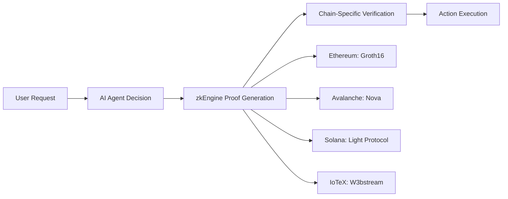

# AgentKit - Universal Verifiable AI Agent Framework

> Demo/Prototype Notice
>
> This repository is a demo and research prototype. It mixes real testnet integrations with simulated and stubbed components. Do not use this code in production. Where possible, files, endpoints, and UI label flows as Real (testnet) or Simulated. See REPO_STATUS.md for a breakdown of what’s real vs. conceptual.

<div align="center">
  
  
  <h3>Demo: Verifiable AI Agent Concepts (testnets + simulations)</h3>
  
  [](https://github.com/hshadab/agentkit)
  [](LICENSE)
  [](zkengine/)
  [](https://github.com/ICME-Lab/jolt-atlas)
  [](https://github.com/agentic-commerce-protocol/agentic-commerce-protocol)
</div>

## 🌟 Overview

AgentKit is a demo/prototype for exploring verifiable AI agents with cryptographic proofs. The current implementation includes examples of OpenAI’s Agentic Commerce Protocol (ACP) coupled with JOLT‑Atlas/zkML proof generation and on‑chain verification on public testnets. Some flows are real (testnet), and others are simulated; each section below calls this out explicitly.

### 🚀 ACP × zkML Integration (Demo)
**The Agent Marketplace Problem**: How do you safely use unverified third-party agents for purchases?

**Concept**: Agent decisions can be accompanied by cryptographic proofs before payment execution. In this demo, some verification paths are real (testnet) and others are simulated.

#### 🎯 5-Step Trustless Commerce Workflow

1. **🏪 Agent Marketplace Selection**
   - Choose from trusted providers (ChatGPT, Claude) or unverified marketplace agents
   - Unverified agents require zkML authorization proof

2. **🧠 AI Agent Inference**
   - Agent runs ONNX neural network (5→16→8→2 architecture)
   - Evaluates: budget_remaining, merchant_trust, amount, category_score, velocity
   - Real-time decision: AUTHORIZED or DENIED with confidence score

3. **🔐 zkML Proof Generation**
   - JOLT‑Atlas generates cryptographic proofs (testnet demo; timing varies by machine)
   - Proves that a given model executed with specific inputs
   - Proof output includes model/input commitments

4. **⛓️ On-Chain Verification**
   - Groth16 verifier contract on Base Sepolia (testnet)
   - Testnet blockchain record for auditability
   - Contract: `0xf752509cb5af017f465B42053d41B730991c6624` (testnet)

5. **💳 ACP Payment Processing**
   - ACP workflow extended with authorization‑proof metadata
   - Stripe integration in test mode
   - Demo UI blocks payment when verification fails; always validate in your own environment

#### 🔗 Integration Features (What’s Real vs Simulated)

- ONNX model example: Small PyTorch→ONNX model bundled for demo (real inference in some paths)
- Cryptographic binding: Proof hash may be embedded in ACP metadata (test/demo)
- Verifiable marketplace: Concept demo only; see REPO_STATUS.md for mocked parts
- Natural‑language rule parsing: Experimental; uses OpenAI API when available (not “GPT‑5”)
- Mixed reality: Some flows are real (testnet), others are simulated; see notes per section

**Demo UI**: http://localhost:9000/index.html (after starting services)

📍 **Location**: `/acp/` directory - Complete integration implementation

### 🎯 Core Features (Demo)
- AI authorization example via ONNX model
- zkML proof generation and on‑chain verification on testnets (where noted)
- Multi‑chain demos: Ethereum/Base Sepolia, Avalanche Fuji, IoTeX Testnet
- x402 HTTP micropayments: example flows with optional proof gating

## 🔐 Environment Variables

All sensitive keys are read from your local environment (never committed). Create a `.env` file in the repo root (gitignored) and set values as needed.

- Core
  - `OPENAI_API_KEY` (required for chat routing)
  - `OPENAI_MODEL` (default: `gpt-4o-mini`)
  - `ZKENGINE_BINARY` (default: `./zkengine/zkEngine`)
  - `WASM_DIR` (default: `./zkengine/example_wasms`)
  - `PROOFS_DIR` (default: `./proofs`)

- Circle Gateway (server forwards with Bearer auth)
  - `CIRCLE_GATEWAY_API_BASE` = `https://gateway-api-testnet.circle.com`
  - `CIRCLE_GATEWAY_API_KEY` = `<apiKey>:<apiSecret>` (testnet)

- Ethereum Sepolia (zkML Groth16 storage verify)
  - `ETH_RPC` = `https://eth-sepolia.public.blastapi.io` (or other)
  - `GROTH16_PRIVATE_KEY` or `PRIVATE_KEY` = `0x...` (EVM key)

- Base (Sepolia)
  - `BASE_RPC_URL` = `https://sepolia.base.org`
  - `BASE_CHAIN_ID` = `84532`
  - `BASE_PRIVATE_KEY` = `0x...`
  - `BASE_AI_COMMITMENT` = Commitment contract (default present in code)

- Avalanche (Fuji)
  - `AVALANCHE_RPC_URL` = `https://api.avax-test.network/ext/bc/C/rpc`
  - `AVALANCHE_CHAIN_ID` = `43113`
  - `AVALANCHE_PRIVATE_KEY` = `0x...`
  - `AVALANCHE_MEDICAL_CONTRACT` = Medical records contract (default from deployments)
  - Optional (storage verifier): `deployments/avax-groth16-storage-fuji.json` is written by the deploy script and auto‑read by `/medical/groth16-verify-store`.

- IoTeX (Testnet 4690)
  - `IOTEX_RPC_URL` = `https://4690.rpc.thirdweb.com` (or other)
  - `IOTEX_PRIVATE_KEY` = `0x...`

Example `.env`
```
OPENAI_API_KEY=sk-...redacted...
OPENAI_MODEL=gpt-4o-mini

# Circle
CIRCLE_GATEWAY_API_BASE=https://gateway-api-testnet.circle.com
CIRCLE_GATEWAY_API_KEY=YOUR_API_KEY:YOUR_API_SECRET

# Ethereum Sepolia
ETH_RPC=https://eth-sepolia.public.blastapi.io
GROTH16_PRIVATE_KEY=0xYOUR_EVM_PRIVATE_KEY

# Base Sepolia
BASE_RPC_URL=https://sepolia.base.org
BASE_CHAIN_ID=84532
BASE_PRIVATE_KEY=0xYOUR_EVM_PRIVATE_KEY

# Avalanche Fuji
AVALANCHE_RPC_URL=https://api.avax-test.network/ext/bc/C/rpc
AVALANCHE_CHAIN_ID=43113
AVALANCHE_PRIVATE_KEY=0xYOUR_EVM_PRIVATE_KEY

# IoTeX Testnet
IOTEX_RPC_URL=https://4690.rpc.thirdweb.com
IOTEX_PRIVATE_KEY=0xYOUR_EVM_PRIVATE_KEY
```

### Recent Changes (Unified 8001 Backend)
- Unified Rust backend on port `8001` now serves UI, WebSocket, and all APIs.
- zkML endpoints (`/zkml/*`) can run locally via JOLT‑Atlas `llm_prover`. On‑chain verify is available via `POST /zkml/verify` (testnet).
- IoTeX proximity, Avalanche medical, and Base AI endpoints can run zkEngine proofs (WASM) locally in the demo:
  - IoTeX step1 uses `zkengine/example_wasms/prove_location.wasm`
  - Avalanche `/medical/generate-proof` uses `wasm_files/medical_integrity.wasm`
  - Base `/ai/generate-zkengine-proof` uses `wasm_files/ai_predictor.wasm`
- Groth16 flows remain via CLI helpers and real on-chain verification.

### How To Test (Quick)
- zkML (local JOLT‑Atlas):
  - Start backend: `cargo run`
  - Prove: `curl -s -X POST localhost:8001/zkml/prove -H 'content-type: application/json' -d '{"prompt":"gateway zkml transfer $0.01"}'`
  - Check status: `curl -s localhost:8001/zkml/status/<sessionId>`
  - Get proof: `curl -s localhost:8001/zkml/proof/<sessionId>`
  - Health: `curl -s localhost:8001/zkml/verify/health`
  - Full workflow (prove -> Groth16 -> on-chain): `curl -s -X POST localhost:8001/zkml/workflow -H 'content-type: application/json' -d '{"prompt":"gateway zkml transfer $0.01"}'`
- IoTeX proximity (Testnet):
  - `curl -s -X POST localhost:8001/iotex/verify-proximity -H 'content-type: application/json' -d '{"deviceX":5005,"deviceY":4995,"deviceSecret":"demo-device"}'`
  - Returns workflow with step1 zkEngine (prove_location.wasm), Groth16 proof-of-proof, and on-chain TX.
- Avalanche medical (Fuji):
  - Create: `curl -s -X POST localhost:8001/medical/create -H 'content-type: application/json' -d '{"patientId":3,"diagnosis":"encrypted","treatment":"encrypted","provider":"Demo"}'`
  - Generate zkEngine: `curl -s -X POST localhost:8001/medical/generate-proof -H 'content-type: application/json' -d '{"sessionId":"<sessionId>"}'`
  - Verify (state-changing TX): `curl -s -X POST localhost:8001/medical/verify -H 'content-type: application/json' -d '{"sessionId":"<sessionId>"}'`
  - Groth16 Verify (view): `curl -s -X POST localhost:8001/medical/groth16-verify -H 'content-type: application/json' -d '{"proof":{...},"publicSignals":[...]}'`
  - Groth16 Verify (storage): `curl -s -X POST localhost:8001/medical/groth16-verify-store -H 'content-type: application/json' -d '{"proof":{...},"publicSignals":[...]}'`
- Base AI prediction (Sepolia):
  - Commit: `curl -s -X POST localhost:8001/ai/commit -H 'content-type: application/json' -d '{"prompt":"Will ETH > $5000?","response":"Yes"}'`
  - zkEngine proof: `curl -s -X POST localhost:8001/ai/generate-zkengine-proof -H 'content-type: application/json' -d '{"sessionId":"<sessionId>"}'`
  - Groth16 reveal (real TX): `curl -s -X POST localhost:8001/ai/generate-groth16-verify -H 'content-type: application/json' -d '{"sessionId":"<sessionId>"}'`

### MetaMask Setup Helper
- Open `http://localhost:8001/static/add-networks.html` in a browser with MetaMask installed.
- Click "Add All Networks" to add: Sepolia, Base Sepolia, Avalanche Fuji, IoTeX Testnet.
- Click "Add USDC Tokens" to add testnet USDC on Sepolia, Base, and Fuji.
- Import your EVM account in MetaMask once: Account icon → Import account → paste your `PRIVATE_KEY` from `.env`.
- Note: Browser wallets require local user approval; networks/tokens must be approved in MetaMask.

### Avalanche Fuji (On‑Chain Verification — Testnet)
- Medical records workflow (UI) performs two real Fuji transactions:
  - Step 1: Create medical record on chain.
  - Step 3: Verify integrity on chain (contract call).
- Recent example TXs (Fuji):
  - Create: https://testnet.snowtrace.io/tx/0xc1633934180effb3ed88a9cb90a2ceb3d958448a50d5787029dd1430a3a19c24
  - Verify: https://testnet.snowtrace.io/tx/0x28b34058c090dc60d58ef07477a1ec90eac4a9a3b37d7e33e3ef7fee464afb3a
- Deployed addresses (Fuji):
  - MedicalRecords (integrity workflow): `0x1698ebB10e789EebE7A66bDb096F0a65ce49Dc68`
  - Real Groth16 Verifier (view): `0xE0Add318E32F65936b8bD74DC122758f543b8166`
  - Groth16 Storage Wrapper (verifyAndStore): `0x6121Fd93594C316B78e74B91B89A06d3Bb682a8F`

### 🆕 ACP × zkML: Integration Details (Demo/Testnet)

**Location**: `/acp/` directory

**Concept**: Extend OpenAI’s Agentic Commerce Protocol with proof requirements. In this demo, agent authorization can be accompanied by proofs before payment execution.

#### Architecture Components

**1. ONNX Authorization Model** (`acp/models/authorization_model.onnx`)
- Example PyTorch neural network (5→16→8→2 architecture)
- Inputs: budget_remaining, merchant_trust, amount, category_score, velocity
- Outputs: authorized (0-1), confidence (0-1)
- 1.8KB model file, deterministic execution

**2. JOLT‑Atlas Proof Service** (Port 9001)
- Binary: `jolt-atlas/target/{release,debug}/llm_prover`
- Generates cryptographic proof of ONNX model execution (demo)
- Timing/proof size vary by build and host
- Includes model hash commitment for integrity

**3. Groth16 Verifier Contract** (Base Sepolia testnet)
- Address: `0xf752509cb5af017f465B42053d41B730991c6624`
- Deployed verifier for zkML decision proofs (testnet)
- View function (read‑only) for verification
- Creates a testnet audit trail when used with transactions

**4. ACP OpenAI Server** (Port 9006)
- ACP‑compatible endpoints with zkML fields (demo)
- Stripe integration (test mode)
- Embeds proof metadata in payment intents (demo)
- Optional natural‑language rule parsing via OpenAI (experimental)

**5. On‑Chain Verification Service** (Port 9004)
- Calls deployed Groth16 verifier (testnet)
- Returns verification status + optional transaction hash
- Demo logic blocks payment execution if verification fails

#### Quick Start (3 Steps)

```bash
# Step 1: Start Services (30 seconds)
cd acp/
node services/gpt5-rule-parser.js > logs/gpt5-parser.log 2>&1 &
node services/acp-openai-server.js > logs/acp-openai.log 2>&1 &
node services/proof-service.js > logs/proof-service.log 2>&1 &
node services/onchain-verification-service.js > logs/verifier.log 2>&1 &
python3 -m http.server 9000 --directory static > logs/ui.log 2>&1 &

# Step 2: Open UI
open http://localhost:9000/index.html

# Step 3: Select agent + scenario, click "Run Agent Inference"
```

#### Test Scenarios (Demo)

The UI includes pre-configured scenarios demonstrating zkML decision making:

**✅ Approved Scenario** (Complex ML):
- Budget: $50, Amount: $45 (90% utilization!)
- Merchant Trust: 0.95 (highly trusted)
- Velocity: 0.2 (steady pattern)
- **ML Decision**: APPROVED despite high budget usage
- **Why**: Neural network recognizes trusted merchant pattern

**❌ Denied Scenario** (Complex ML):
- Budget: $500, Amount: $15 (only 3% utilization)
- Merchant Trust: 0.15 (low trust)
- Velocity: 0.9 (unusual spike)
- **ML Decision**: DENIED despite available budget
- **Why**: Neural network detects fraud signals

**Stripe Test Card**: `4242 4242 4242 4242` with any future expiry/CVC

#### Documentation

- **[VERIFICATION.md](acp/VERIFICATION.md)** - Independent verification (no marketing, just commands)
- **[ACP_ENDPOINTS.md](acp/ACP_ENDPOINTS.md)** - Complete API reference
- **[DOCKER.md](acp/DOCKER.md)** - Docker deployment
- **[contracts/README.md](acp/contracts/README.md)** - Smart contract docs

#### Use Cases
- **Agent Marketplace**: Enable untrusted third-party agents with cryptographic guarantees
- **Personal Finance**: AI agents manage spending with verifiable rules
- **Corporate Procurement**: Autonomous purchasing with compliance proofs
- **Travel Booking**: Smart agents with budget constraints
- **IoT Micropayments**: Device-to-device commerce with authorization proofs

### x402 Proof‑Gated Demo (zkML + zkEngine)
- Location: `x402/`
- Purpose: gate an x402‑style endpoint behind a zkML proof attestation (optionally add a zkEngine policy check), illustrating how ZK extends trust before payment/compute.
- Run:
  - `node api/unified-backend.js` (port 8002)
  - `node x402/proof-gate-server.js` (port 8602)
  - `node x402/client-demo.js`
  - The protected endpoint only authorizes when `X-ZKML-Attestation` is valid.
  - Nonce/replay protection enforced for x402 headers (X-402-Nonce, timestamp window). Configure `.env` with `X402_SHARED_SECRET`, `X402_REPLAY_WINDOW_MS`, `X402_ALLOWED_SKEW_MS`.

### OpenAI Orchestration (Scope)
- OpenAI (default model `gpt-4o-mini`) is used only for parsing free‑form chat into a strict JSON intent that maps to allowed workflows.
- Proof generation and on‑chain verification run independently of OpenAI.
- Direct REST calls and UI shortcuts do not require OpenAI.


### What’s Real vs Simulated
- Cryptographic proofs: Real proofs exist in several flows; see REPO_STATUS.md and per‑directory READMEs for which endpoints are real (testnet) vs simulated.
- Smart contracts: Testnet contracts are deployed and verifiable on explorers where noted.
- Transactions: Example testnet transactions are linked where available.
- Simulations: Some demos simulate delays or verification; these are marked in code/docs.

## 🎯 Core Technologies

### zkEngine - Universal Proof Generation
Our Rust-based zkEngine compiles to WASM for browser execution, enabling:
- **14+ proof types** including KYC, location, IoT, medical records
- **Sub-second proof generation** for time-critical operations
- **Cross-platform compatibility** (browser, Node.js, mobile)
- **Memory-efficient execution** with streaming verification

### zkML with JOLT-Atlas (Demo/Testnet)
Production-ready zero-knowledge machine learning:
- **14-parameter LLM decision model** with real Rust implementation
- **~500ms proof generation** using compiled binary (not simulated)
- **Recursive SNARKs** with lookup tables for efficiency
- **On-chain verification** on testnets (costs vary)

### Multi-Chain Architecture
Deploy once, verify everywhere:
- **Ethereum & L2s**: Base, Arbitrum, Optimism
- **Avalanche**: Healthcare and medical records focus
- **Solana**: High-frequency trading and gaming
- **IoTeX**: IoT device attestation and proximity proofs
- **Circle Integration**: Gateway for attestations, CCTP for native transfers

## 🏥 Blockchain-Specific Use Cases

### Avalanche - Healthcare & Medical Records
```javascript
// Example: Groth16 proof-of-proof verification on-chain (testnet)
// Step 1: Create medical record on-chain (costs AVAX)
const record = await createMedicalRecord({
    patientId: 3,
    recordData: 549,  // Encoded medical data
    diagnosis: "encrypted"
});

// Step 2: Generate Groth16 proof (1-2 seconds)
const proof = await snarkjs.groth16.fullProve(input, WASM, ZKEY);

// Step 3: Verify proof cryptographically on-chain (costs AVAX)
const verified = await verifierContract.verifyProof(
    proof.a, proof.b, proof.c, publicSignals
);

// Groth16 Verifier: 0xe285dA4D9808DEabb0608Fb2f8F99256Bd80e0ea
// Records Contract: 0x1698ebB10e789EebE7A66bDb096F0a65ce49Dc68
// Example TX: 0x9cc6aa7b74ab4e4bba1348ff69c3b8e7d9e279309a738a1abb6befc233f09951
```

### Base - AI Predictions & DeFi Trading
```javascript
// NEW: AI Prediction with Commit-Reveal Scheme (Port 8004)
// Prove AI made prediction before outcome was known
const commitment = await aiPredictor.commit({
    prompt: "Will ETH exceed $5000 by end of month?",
    response: "Yes, based on technical indicators",
    nonce: generateNonce()
});

// After outcome is known, reveal with Groth16 proof
const proof = await aiPredictor.generateProof(commitment);
const revealed = await aiPredictor.reveal(proof);

// Also supports zkEngine + Groth16 hybrid (Port 8005)
// Combines WASM proof generation with on-chain verification
```

### Solana - High-Performance Gaming
```javascript
// Verify game state transitions at 65,000 TPS
const proof = await zkEngine.generateGameStateProof({
    playerMove: "encrypted",
    fairnessCheck: true,
    randomSeed: "verifiable"
});
```

### IoTeX - IoT Device Verification
```javascript
// NEW: zkEngine-powered proximity proofs (Port 8006)
// Prove device location without revealing coordinates
const proof = await zkEngine.generateProximityProof({
    deviceId: "0xDEVICE123",
    targetLocation: { lat: 37.7749, lon: -122.4194 },
    maxDistance: 100,  // meters
    timestamp: Date.now()
});

// On-chain verification with IoTeX W3bstream
const verified = await iotexContract.verifyProximity(proof);
```

## 📊 Proof Types & Workflows

### Available Proof Systems

| Proof Type | Use Case | Generation Time | Chain Support | Port |
|------------|----------|-----------------|---------------|------|
| **zkML LLM Decision** | AI decision verification | ~500ms | All EVM chains | 8002 |
| **Groth16 JOLT Verifier** | On-chain proof verification | ~2s | Ethereum Sepolia | 3004 |
| **Avalanche Medical** | Healthcare records with Groth16 | ~2s | Avalanche Fuji | 8003 |
| **Base AI Prediction** | Commit-reveal AI predictions | ~2s | Base Sepolia | 8004 |
| **Base zkEngine+Groth16** | Hybrid WASM+Groth16 proofs | ~3s | Base Sepolia | 8005 |
| **IoTeX Proximity** | Device location proofs | ~1s | IoTeX Testnet | 8006 |
| **Gateway Balance** | Circle USDC balance checking | instant | All chains | 8007 |
| **KYC Compliance** | Identity verification | ~2s | All EVM chains | - |
| **Trading Decisions** | DeFi strategy compliance | ~2s | Base, Ethereum | - |
| **Payment Authorization** | USDC transfers | ~10s | All chains | - |
| **Game State** | Fair play verification | ~500ms | Solana | - |

### Complete Workflow Example


```mermaid
graph LR
    A[User Request] --> B[AI Agent Decision]
    B --> C[zkEngine Proof Generation]
    C --> D[Chain-Specific Verification]
    D --> E[Action Execution]
    
    C --> F[Ethereum: Groth16]
    C --> G[Avalanche: Nova]
    C --> H[Solana: Light Protocol]
    C --> I[IoTeX: W3bstream]
```

## Reality of This Demo

### zkML Proof Generation (Real/Testnet)
- Binary: `/jolt-atlas/target/release/llm_prover` (Rust compiled)
- Proof time depends on host and build
- Verification: On‑chain on testnets where noted

### On‑Chain Verification (Testnets)
- Example contracts/transactions are on public testnets (e.g., Sepolia/Base, Fuji). Links are included where available.
- Gas costs and timings vary and are for demonstration.

### Circle Gateway Integration (Test Mode)
- Uses Stripe/Circle test/sandbox where applicable.
- Values, fees, and balances in docs are illustrative and may change.

## 🚀 Quick Start

### Installation
```bash
# Clone repository
git clone https://github.com/hshadab/agentkit
cd agentkit

# Install dependencies
npm install
cargo build --release

# Start unified backend + services
cargo run                                   # Port 8001 - UI + unified API (proxies + OpenAI parsing)
node api/zkml-llm-decision-backend.js       # Port 8002 - zkML backend (JOLT‑Atlas)
```

### Run zkML Gateway (Demo/Testnet)
```bash
# 1) Start services (in separate terminals)
cargo run                                   # http://localhost:8001/
node api/zkml-llm-decision-backend.js       # zkML at http://localhost:8002
export CIRCLE_GATEWAY_API_KEY='SAND_API_KEY:...'  # Circle sandbox key

# 2) Open the UI
open http://localhost:8001/

# 3) In the UI, trigger "Circle Gateway zkML Workflow"
#    Step 1: zkML proof (local JOLT‑Atlas)
#    Step 2: On‑chain verification (testnet) → returns transaction hash + explorer link
#    Step 3: Circle Gateway attestation (test/sandbox; server‑side API key)
```

### Circle Gateway Testnet Fees & Values (Observed)
- No enforced 2.00 USDC minimum transfer value per chain.
- Per‑intent fee on testnet ≈ 2.0000 USDC (response `fees.total`).
- Debit per chain ≈ transfer value + fees.total.

Examples:
- 1 chain, value 2.00 → fees ≈ 2.0001 → debit ≈ 4.00 USDC
- 1 chain, value 1.00 → fees ≈ 2.00005 → debit ≈ 3.00 USDC
- 2 chains, value 2.00 each → debit ≈ 8.00 USDC total
```

### Running Different Proof Types

#### Healthcare Proof (Avalanche)
```bash
# Generate medical record integrity proof
node examples/avalanche-medical-proof.js

# Verify on Avalanche C-Chain
node scripts/verify-avalanche.js
```

#### IoT Device Proof (IoTeX)
```bash
# Generate proximity attestation
node examples/iotex-proximity-proof.js

# Deploy to IoTeX testnet
npm run deploy:iotex
```

#### Trading Proof (Base)
```bash
# Generate DeFi compliance proof
node examples/base-trading-proof.js

# Verify on Base Sepolia
npm run verify:base
```

## 🏗️ Project Structure

```
agentkit/
├── zkengine/           # Rust zkEngine core
│   ├── src/           # Proof generation logic
│   ├── wasm/          # WASM compilation
│   └── bindings/      # Language bindings
├── circuits/          # Circom circuits
│   ├── medical/       # Healthcare circuits
│   ├── trading/       # DeFi circuits
│   └── iot/          # IoT circuits
├── contracts/         # Smart contracts
│   ├── ethereum/      # Ethereum verifiers
│   ├── avalanche/     # Avalanche verifiers
│   ├── solana/        # Solana programs
│   └── iotex/        # IoTeX contracts
├── circle/            # Circle integration
│   ├── gateway/       # Attestation-based transfers
│   └── cctp/         # Cross-chain transfer protocol
├── acp/              # 🆕 ACP × JOLT-Atlas Integration
│   ├── services/      # Proof, Payment, Verification services
│   ├── models/        # ONNX authorization model
│   ├── static/        # Demo UI
│   └── tests/        # End-to-end tests
├── api/              # Backend services
│   ├── zkml-backend.js
│   └── groth16-verifier.js
└── examples/         # Usage examples
```

## 📈 Performance Notes (Demo)

| Operation | Time | Gas Cost | Chains |
|-----------|------|----------|---------|
| zkML Proof Generation | 10s | N/A | All |
| Groth16 Verification | 2s | ~150k | EVM |
| Nova Verification | 3s | ~200k | Avalanche |
| Solana Verification | 500ms | ~5k lamports | Solana |
| Circle Transfer | 15-30min | ~100k | Ethereum, Base, Avalanche |

## 🔐 Security Considerations

- No formal audits. Do not use in production.
- Keys must be provided via local `.env` for demos; never commit secrets.
- Example contracts are on testnets; production key management, audits, and monitoring are out of scope.

## 🛠️ Development

### Building zkEngine
```bash
cd zkengine
cargo build --release
wasm-pack build --target web
```

### Running Tests
```bash
# Unit tests
npm test

# Integration tests
npm run test:integration

# Circuit tests
npm run test:circuits
```

### Deploying Contracts
```bash
# Deploy to specific chain
npm run deploy:ethereum
npm run deploy:avalanche
npm run deploy:base
npm run deploy:iotex
npm run deploy:solana
```

## 📚 Documentation

- [zkEngine Documentation](zkengine/README.md)
- [Circuit Design Guide](circuits/DESIGN.md)
- [API Reference](docs/API.md)
- [Circle Integration Guide](circle/gateway/README.md)
- [Deployment Guide](docs/DEPLOYMENT.md)

## 🤝 Contributing

We welcome contributions! Please see our [Contributing Guide](CONTRIBUTING.md) for details.

## 📄 License

MIT License - see [LICENSE](LICENSE) for details.

## 🔗 Links

- **GitHub**: [github.com/hshadab/agentkit](https://github.com/hshadab/agentkit)
- **Documentation**: [docs.agentkit.dev](https://docs.agentkit.dev)
- **Discord**: [discord.gg/agentkit](https://discord.gg/agentkit)
- **Twitter**: [@agentkitdev](https://twitter.com/agentkitdev)

## 🙏 Acknowledgments

Built with technologies from:
- [Circle](https://www.circle.com) - USDC infrastructure
- [IoTeX](https://iotex.io) - IoT blockchain platform
- [Avalanche](https://avax.network) - Healthcare-focused subnet
- [Base](https://base.org) - Ethereum L2 for DeFi
- [Solana](https://solana.com) - High-performance blockchain
