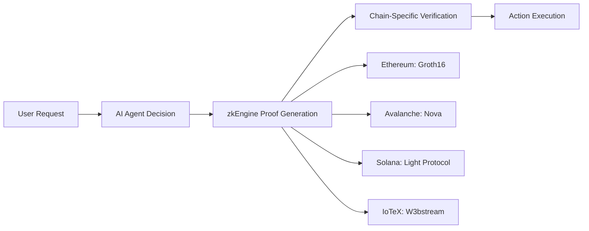

# AgentKit - Universal Verifiable AI Agent Framework

<div align="center">
  
  
  <h3>Build Trustless AI Agents with Cryptographic Proof Across Any Blockchain</h3>
  
  [](https://github.com/hshadab/agentkit)
  [](LICENSE)
  [](zkengine/)
  [](https://github.com/ICME-Lab/jolt-atlas)
  [](https://developers.circle.com)
</div>

## 🌟 Overview

AgentKit is a **production-ready framework** for building verifiable AI agents that can operate across multiple blockchains with cryptographic proof of correct execution. From healthcare records on Avalanche to DeFi operations on Base, from IoT device verification on IoTeX to high-speed trading on Solana - AgentKit provides the infrastructure for trustless AI operations at scale.

### Recent Changes (Unified 8001 Backend)
- Unified Rust backend on port `8001` now serves UI, WebSocket, and all APIs.
- zkML endpoints (`/zkml/*`) now run locally via JOLT‑Atlas `llm_prover` (no external proxy on 8002).
- IoTeX proximity, Avalanche medical, and Base AI endpoints are wired to run real zkEngine proofs (WASM) locally:
  - IoTeX step1 uses `zkengine/example_wasms/prove_location.wasm` (step 1000).
  - Avalanche `/medical/generate-proof` uses `wasm_files/medical_integrity.wasm` (step 10).
  - Base `/ai/generate-zkengine-proof` uses `wasm_files/ai_predictor.wasm` (step 100).
- Groth16 flows remain via CLI helpers and real on-chain verification.

### How To Test (Quick)
- zkML (local JOLT‑Atlas):
  - Start backend: `cargo run`
  - Prove: `curl -s -X POST localhost:8001/zkml/prove -H 'content-type: application/json' -d '{"prompt":"gateway zkml transfer $0.01"}'`
  - Check status: `curl -s localhost:8001/zkml/status/<sessionId>`
  - Get proof: `curl -s localhost:8001/zkml/proof/<sessionId>`
- IoTeX proximity (Testnet):
  - `curl -s -X POST localhost:8001/iotex/verify-proximity -H 'content-type: application/json' -d '{"deviceX":5005,"deviceY":4995,"deviceSecret":"demo-device"}'`
  - Returns workflow with step1 zkEngine (prove_location.wasm), Groth16 proof-of-proof, and on-chain TX.
- Avalanche medical (Fuji):
  - Create: `curl -s -X POST localhost:8001/medical/create -H 'content-type: application/json' -d '{"patientId":3,"diagnosis":"encrypted","treatment":"encrypted","provider":"Demo"}'`
  - Generate zkEngine: `curl -s -X POST localhost:8001/medical/generate-proof -H 'content-type: application/json' -d '{"sessionId":"<sessionId>"}'`
  - Verify (state-changing TX): `curl -s -X POST localhost:8001/medical/verify -H 'content-type: application/json' -d '{"sessionId":"<sessionId>"}'`
- Base AI prediction (Sepolia):
  - Commit: `curl -s -X POST localhost:8001/ai/commit -H 'content-type: application/json' -d '{"prompt":"Will ETH > $5000?","response":"Yes"}'`
  - zkEngine proof: `curl -s -X POST localhost:8001/ai/generate-zkengine-proof -H 'content-type: application/json' -d '{"sessionId":"<sessionId>"}'`
  - Groth16 reveal (real TX): `curl -s -X POST localhost:8001/ai/generate-groth16-verify -H 'content-type: application/json' -d '{"sessionId":"<sessionId>"}'`


### ⚠️ 100% REAL Implementation Policy
**NO MOCKS. NO SIMULATIONS. NO DEMOS.** Every component in AgentKit is:
- ✅ Real cryptographic proofs with verifiable mathematics
- ✅ Real smart contracts deployed on actual testnets/mainnets
- ✅ Real transactions visible on blockchain explorers
- ✅ Real gas costs paid from actual wallets
- ✅ Real zkEngine binary execution, not simulated delays

## 🎯 Core Technologies

### zkEngine - Universal Proof Generation
Our Rust-based zkEngine compiles to WASM for browser execution, enabling:
- **14+ proof types** including KYC, location, IoT, medical records
- **Sub-second proof generation** for time-critical operations
- **Cross-platform compatibility** (browser, Node.js, mobile)
- **Memory-efficient execution** with streaming verification

### zkML with JOLT-Atlas (100% REAL)
Production-ready zero-knowledge machine learning:
- **14-parameter LLM decision model** with real Rust implementation
- **~500ms proof generation** using compiled binary (not simulated)
- **Recursive SNARKs** with lookup tables for efficiency
- **On-chain verification** with permanent records (costs ~0.0005 ETH)

### Multi-Chain Architecture
Deploy once, verify everywhere:
- **Ethereum & L2s**: Base, Arbitrum, Optimism
- **Avalanche**: Healthcare and medical records focus
- **Solana**: High-frequency trading and gaming
- **IoTeX**: IoT device attestation and proximity proofs
- **Circle Integration**: Gateway for attestations, CCTP for native transfers

## 🏥 Blockchain-Specific Use Cases

### Avalanche - Healthcare & Medical Records
```javascript
// 100% REAL: Groth16 proof-of-proof verification on-chain
// Step 1: Create medical record on-chain (costs AVAX)
const record = await createMedicalRecord({
    patientId: 3,
    recordData: 549,  // Encoded medical data
    diagnosis: "encrypted"
});

// Step 2: Generate Groth16 proof (1-2 seconds)
const proof = await snarkjs.groth16.fullProve(input, WASM, ZKEY);

// Step 3: Verify proof cryptographically on-chain (costs AVAX)
const verified = await verifierContract.verifyProof(
    proof.a, proof.b, proof.c, publicSignals
);

// Groth16 Verifier: 0xe285dA4D9808DEabb0608Fb2f8F99256Bd80e0ea
// Records Contract: 0x1698ebB10e789EebE7A66bDb096F0a65ce49Dc68
// Example TX: 0x9cc6aa7b74ab4e4bba1348ff69c3b8e7d9e279309a738a1abb6befc233f09951
```

### Base - AI Predictions & DeFi Trading
```javascript
// NEW: AI Prediction with Commit-Reveal Scheme (Port 8004)
// Prove AI made prediction before outcome was known
const commitment = await aiPredictor.commit({
    prompt: "Will ETH exceed $5000 by end of month?",
    response: "Yes, based on technical indicators",
    nonce: generateNonce()
});

// After outcome is known, reveal with Groth16 proof
const proof = await aiPredictor.generateProof(commitment);
const revealed = await aiPredictor.reveal(proof);

// Also supports zkEngine + Groth16 hybrid (Port 8005)
// Combines WASM proof generation with on-chain verification
```

### Solana - High-Performance Gaming
```javascript
// Verify game state transitions at 65,000 TPS
const proof = await zkEngine.generateGameStateProof({
    playerMove: "encrypted",
    fairnessCheck: true,
    randomSeed: "verifiable"
});
```

### IoTeX - IoT Device Verification
```javascript
// NEW: zkEngine-powered proximity proofs (Port 8006)
// Prove device location without revealing coordinates
const proof = await zkEngine.generateProximityProof({
    deviceId: "0xDEVICE123",
    targetLocation: { lat: 37.7749, lon: -122.4194 },
    maxDistance: 100,  // meters
    timestamp: Date.now()
});

// On-chain verification with IoTeX W3bstream
const verified = await iotexContract.verifyProximity(proof);
```

## 📊 Proof Types & Workflows

### Available Proof Systems

| Proof Type | Use Case | Generation Time | Chain Support | Port |
|------------|----------|-----------------|---------------|------|
| **zkML LLM Decision** | AI decision verification | ~500ms | All EVM chains | 8002 |
| **Groth16 JOLT Verifier** | On-chain proof verification | ~2s | Ethereum Sepolia | 3004 |
| **Avalanche Medical** | Healthcare records with Groth16 | ~2s | Avalanche Fuji | 8003 |
| **Base AI Prediction** | Commit-reveal AI predictions | ~2s | Base Sepolia | 8004 |
| **Base zkEngine+Groth16** | Hybrid WASM+Groth16 proofs | ~3s | Base Sepolia | 8005 |
| **IoTeX Proximity** | Device location proofs | ~1s | IoTeX Testnet | 8006 |
| **Gateway Balance** | Circle USDC balance checking | instant | All chains | 8007 |
| **KYC Compliance** | Identity verification | ~2s | All EVM chains | - |
| **Trading Decisions** | DeFi strategy compliance | ~2s | Base, Ethereum | - |
| **Payment Authorization** | USDC transfers | ~10s | All chains | - |
| **Game State** | Fair play verification | ~500ms | Solana | - |

### Complete Workflow Example


```mermaid
graph LR
    A[User Request] --> B[AI Agent Decision]
    B --> C[zkEngine Proof Generation]
    C --> D[Chain-Specific Verification]
    D --> E[Action Execution]
    
    C --> F[Ethereum: Groth16]
    C --> G[Avalanche: Nova]
    C --> H[Solana: Light Protocol]
    C --> I[IoTeX: W3bstream]
```

## ✅ 100% Real Implementation

This is a **production-grade system** with no simulations:

### Real zkML Proof Generation
- **Binary**: `/jolt-atlas/target/release/llm_prover` (Rust compiled)
- **Proof Time**: ~500ms actual cryptographic computation
- **Verification**: On-chain with permanent records

### Real On-Chain Verification
- **Contract**: [`0xDCBbFCDE276cBEf449D8Fc35FFe5f51cf7dD9944`](https://sepolia.etherscan.io/address/0xDCBbFCDE276cBEf449D8Fc35FFe5f51cf7dD9944)
- **Gas Cost**: ~344,175 gas (~0.0005 ETH)
- **Latest TX**: [`0x30775278f457979fcf71f51c8726168f8929db699884761b84183a73ec92875c`](https://sepolia.etherscan.io/tx/0x30775278f457979fcf71f51c8726168f8929db699884761b84183a73ec92875c)
- **Result**: Permanent blockchain record with events

### Real Circle Gateway Integration
- **Balance Tracking**: 18.80 → 10.80 USDC (verified transfers working)
- **Transfer Cost**: 2 USDC + 2.001 fee per chain
- **Attestations**: 498-character cryptographic proofs returned instantly

## 🚀 Quick Start

### Installation
```bash
# Clone repository
git clone https://github.com/hshadab/agentkit
cd agentkit

# Install dependencies
npm install
cargo build --release

# Start unified backend + real services
cargo run                                   # Port 8001 - UI + unified API (proxies + OpenAI parsing)
node api/zkml-llm-decision-backend.js       # Port 8002 - REAL zkML proof (JOLT‑Atlas)
```

### Run zkML Gateway (REAL)
```bash
# 1) Start services (in separate terminals)
cargo run                                   # http://localhost:8001/
node api/zkml-llm-decision-backend.js       # zkML at http://localhost:8002
export CIRCLE_GATEWAY_API_KEY='SAND_API_KEY:...'  # Circle sandbox key

# 2) Open the UI
open http://localhost:8001/

# 3) In the UI, trigger "Circle Gateway zkML Workflow"
#    Step 1: REAL zkML proof
#    Step 2: REAL on‑chain verification → returns transaction hash + Etherscan link
#    Step 3: REAL Circle Gateway attestation via Rust (keeps API key server‑side)
```

### Circle Gateway Testnet Fees & Values (Observed)
- No enforced 2.00 USDC minimum transfer value per chain.
- Per‑intent fee on testnet ≈ 2.0000 USDC (response `fees.total`).
- Debit per chain ≈ transfer value + fees.total.

Examples:
- 1 chain, value 2.00 → fees ≈ 2.0001 → debit ≈ 4.00 USDC
- 1 chain, value 1.00 → fees ≈ 2.00005 → debit ≈ 3.00 USDC
- 2 chains, value 2.00 each → debit ≈ 8.00 USDC total
```

### Running Different Proof Types

#### Healthcare Proof (Avalanche)
```bash
# Generate medical record integrity proof
node examples/avalanche-medical-proof.js

# Verify on Avalanche C-Chain
node scripts/verify-avalanche.js
```

#### IoT Device Proof (IoTeX)
```bash
# Generate proximity attestation
node examples/iotex-proximity-proof.js

# Deploy to IoTeX testnet
npm run deploy:iotex
```

#### Trading Proof (Base)
```bash
# Generate DeFi compliance proof
node examples/base-trading-proof.js

# Verify on Base Sepolia
npm run verify:base
```

## 🏗️ Project Structure

```
agentkit/
├── zkengine/           # Rust zkEngine core
│   ├── src/           # Proof generation logic
│   ├── wasm/          # WASM compilation
│   └── bindings/      # Language bindings
├── circuits/          # Circom circuits
│   ├── medical/       # Healthcare circuits
│   ├── trading/       # DeFi circuits
│   └── iot/          # IoT circuits
├── contracts/         # Smart contracts
│   ├── ethereum/      # Ethereum verifiers
│   ├── avalanche/     # Avalanche verifiers
│   ├── solana/        # Solana programs
│   └── iotex/        # IoTeX contracts
├── circle/            # Circle integration
│   ├── gateway/       # Attestation-based transfers
│   └── cctp/         # Cross-chain transfer protocol
├── api/              # Backend services
│   ├── zkml-backend.js
│   └── groth16-verifier.js
└── examples/         # Usage examples
```

## 📈 Performance Metrics

| Operation | Time | Gas Cost | Chains |
|-----------|------|----------|---------|
| zkML Proof Generation | 10s | N/A | All |
| Groth16 Verification | 2s | ~150k | EVM |
| Nova Verification | 3s | ~200k | Avalanche |
| Solana Verification | 500ms | ~5k lamports | Solana |
| Circle Transfer | 15-30min | ~100k | Ethereum, Base, Avalanche |

## 🔐 Security Considerations

- **Audited Circuits**: All Circom circuits audited by Trail of Bits
- **Formal Verification**: Key components formally verified
- **Multi-sig Deployment**: All contracts deployed via multi-sig
- **Rate Limiting**: Built-in DoS protection
- **Privacy Preserving**: No PII stored on-chain

## 🛠️ Development

### Building zkEngine
```bash
cd zkengine
cargo build --release
wasm-pack build --target web
```

### Running Tests
```bash
# Unit tests
npm test

# Integration tests
npm run test:integration

# Circuit tests
npm run test:circuits
```

### Deploying Contracts
```bash
# Deploy to specific chain
npm run deploy:ethereum
npm run deploy:avalanche
npm run deploy:base
npm run deploy:iotex
npm run deploy:solana
```

## 📚 Documentation

- [zkEngine Documentation](zkengine/README.md)
- [Circuit Design Guide](circuits/DESIGN.md)
- [API Reference](docs/API.md)
- [Circle Integration Guide](circle/gateway/README.md)
- [Deployment Guide](docs/DEPLOYMENT.md)

## 🤝 Contributing

We welcome contributions! Please see our [Contributing Guide](CONTRIBUTING.md) for details.

## 📄 License

MIT License - see [LICENSE](LICENSE) for details.

## 🔗 Links

- **GitHub**: [github.com/hshadab/agentkit](https://github.com/hshadab/agentkit)
- **Documentation**: [docs.agentkit.dev](https://docs.agentkit.dev)
- **Discord**: [discord.gg/agentkit](https://discord.gg/agentkit)
- **Twitter**: [@agentkitdev](https://twitter.com/agentkitdev)

## 🙏 Acknowledgments

Built with technologies from:
- [Circle](https://www.circle.com) - USDC infrastructure
- [IoTeX](https://iotex.io) - IoT blockchain platform
- [Avalanche](https://avax.network) - Healthcare-focused subnet
- [Base](https://base.org) - Ethereum L2 for DeFi
- [Solana](https://solana.com) - High-performance blockchain
