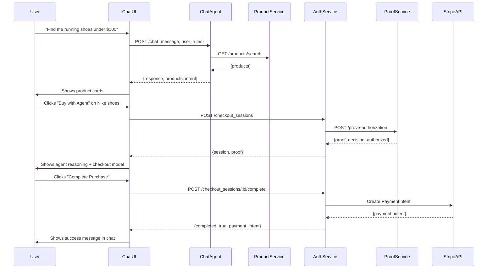

# Conversational Shopping Demo Plan

Transforming the ACP demo from form-based to conversational shopping experience (OpenAI-style).

**Goal**: Create a ChatGPT-like shopping interface where users ask for product recommendations and the AI agent handles authorization, proof generation, and checkout.

---

## 🎯 Vision

### Current Demo (Form-Based)
```
❌ Fill form fields → Click button → See authorization result → Payment
```

### Target Demo (Conversational)
```
✅ "Find me running shoes under $100"
   → Agent shows products
   → User clicks "Buy with Agent"
   → Agent reasons about authorization
   → zkML proof generated
   → One-click checkout
   → Success in chat
```

---

## 🏗️ Architecture

### New Services

#### 1. Product Discovery Service (Port 9007)
```javascript
// File: services/product-discovery-service.js
POST /discover-products
{
  query: "running shoes under $100",
  preferences: { budget: 100, category: "shoes" }
}

Response:
{
  products: [
    {
      id: "prod_001",
      name: "Nike Air Zoom",
      price: 89.99,
      merchant: "merchant_nike_001",
      merchant_trust: 0.95,
      category: "shoes",
      rating: 4.8,
      image: "/static/images/nike-air-zoom.jpg",
      description: "Lightweight running shoes with responsive cushioning",
      supports_instant_checkout: true
    }
  ],
  agent_reasoning: "I found 3 highly-rated running shoes within your budget..."
}
```

#### 2. Chat Agent Service (Port 9008)
```javascript
// File: services/chat-agent-service.js
POST /chat
{
  message: "Find me running shoes under $100",
  conversation_id: "conv_123",
  user_rules: { monthly_limit: 500, ... }
}

Response:
{
  response: "I found 3 great options for you...",
  intent: "product_search",
  extracted_params: { category: "shoes", max_price: 100 },
  products: [...],  // If product search intent
  next_action: "show_products"
}
```

#### 3. Merchant Aggregator (Port 9009)
```javascript
// File: services/merchant-aggregator.js
// Aggregates products from multiple mock merchants
GET /merchants/:merchant_id/products
GET /products/search?q=shoes&category=running&max_price=100
```

---

## 📊 Mock Product Database

### Product Categories
- **Shoes** (Running, Casual, Formal) - 5 products
- **Ceramics** (Mugs, Bowls, Plates) - 3 products
- **Books** (Fiction, Tech, Business) - 4 products
- **Groceries** (Organic, Snacks, Beverages) - 4 products
- **Electronics** (Headphones, Keyboards, Mice) - 4 products

### Merchant Profiles
```javascript
const MERCHANTS = {
  "merchant_nike_001": {
    name: "Nike Official Store",
    trust: 0.95,
    category: "shoes",
    logo: "/static/images/merchants/nike.png"
  },
  "merchant_etsy_ceramics": {
    name: "Artisan Ceramics Shop",
    trust: 0.88,
    category: "ceramics",
    logo: "/static/images/merchants/etsy.png"
  },
  "merchant_bookstore": {
    name: "Tech Books Direct",
    trust: 0.92,
    category: "books",
    logo: "/static/images/merchants/books.png"
  },
  "merchant_whole_foods": {
    name: "Whole Foods Market",
    trust: 0.97,
    category: "groceries",
    logo: "/static/images/merchants/wholefoods.png"
  },
  "merchant_electronics": {
    name: "Best Electronics",
    trust: 0.90,
    category: "electronics",
    logo: "/static/images/merchants/electronics.png"
  }
};

const PRODUCTS = [
  // Shoes
  {
    id: "prod_shoe_001",
    name: "Nike Air Zoom Pegasus",
    price: 89.99,
    merchant: "merchant_nike_001",
    category: "shoes",
    subcategory: "running",
    rating: 4.8,
    reviews: 2341,
    image: "/static/images/products/nike-air-zoom.jpg",
    description: "Lightweight running shoes with responsive cushioning"
  },
  // ... 19 more products
];
```

---

## 🎨 UI Components

### File Structure
```
acp/static/
├── index-chat.html              # NEW: Main chat demo
├── css/
│   ├── chat.css                 # NEW: Chat interface styles
│   ├── product-cards.css        # NEW: Product card styles
│   └── checkout-modal.css       # NEW: Checkout modal styles
├── js/
│   ├── chat-interface.js        # NEW: Message rendering
│   ├── product-cards.js         # NEW: Product display
│   ├── checkout-flow.js         # NEW: Checkout modal
│   └── agent-reasoning.js       # NEW: Authorization display
└── images/
    ├── products/                # NEW: Product images
    │   ├── nike-air-zoom.jpg
    │   ├── ceramic-mug.jpg
    │   └── [18 more...]
    └── merchants/               # NEW: Merchant logos
        ├── nike.png
        ├── etsy.png
        └── [3 more...]
```

### Chat Interface HTML Structure
```html
<div class="chat-container">
  <div class="chat-header">
    <h1>🤖 Verifiable Agent Commerce</h1>
    <p>Powered by GPT-5 × zkML × Stripe</p>
  </div>

  <div class="chat-messages" id="chatMessages">
    <!-- Messages rendered here -->
    <div class="message agent">
      <div class="avatar">🤖</div>
      <div class="content">
        <p>Hi! What are you shopping for today?</p>
      </div>
    </div>

    <div class="message user">
      <div class="content">
        <p>Running shoes under $100</p>
      </div>
      <div class="avatar">👤</div>
    </div>

    <div class="message agent">
      <div class="avatar">🤖</div>
      <div class="content">
        <p>💭 Searching for running shoes...</p>
        <div class="product-cards">
          <!-- Product cards here -->
        </div>
      </div>
    </div>
  </div>

  <div class="chat-input">
    <input type="text" id="messageInput" placeholder="Ask for product recommendations...">
    <button id="sendBtn">Send</button>
  </div>
</div>
```

### Product Card Component
```html
<div class="product-card">
  
  <div class="product-info">
    <h3>Nike Air Zoom Pegasus</h3>
    <div class="merchant">
      
      <span>Nike Official Store</span>
      <span class="trust-badge">✅ 95% trust</span>
    </div>
    <div class="price">$89.99</div>
    <div class="rating">⭐ 4.8 (2,341 reviews)</div>
    <p class="description">Lightweight running shoes with responsive cushioning</p>
  </div>
  <div class="product-actions">
    <button class="btn-buy-with-agent" data-product-id="prod_shoe_001">
      🤖 Buy with Agent
    </button>
    <button class="btn-details">Details</button>
  </div>
</div>
```

### Agent Reasoning Display
```html
<div class="agent-reasoning">
  <div class="thinking-header">
    <span class="icon">💭</span>
    <span>Agent Reasoning</span>
  </div>

  <div class="authorization-checks">
    <div class="check passed">
      <span class="icon">✅</span>
      <span>Budget check: $89.99 &lt; $500 monthly limit</span>
    </div>
    <div class="check passed">
      <span class="icon">✅</span>
      <span>Merchant trust: Nike Official (95% trust)</span>
    </div>
    <div class="check passed">
      <span class="icon">✅</span>
      <span>Category: Shoes allowed in your rules</span>
    </div>
    <div class="check passed">
      <span class="icon">✅</span>
      <span>Amount: Within $250 per-transaction limit</span>
    </div>
  </div>

  <div class="decision authorized">
    <strong>🤖 Decision: AUTHORIZED</strong> (100% confidence)
  </div>

  <div class="proof-generation">
    <div class="step">🔐 Generating zkML proof...</div>
    <div class="step">✅ Proof: 0xa36dd8d6...</div>
    <div class="step">📡 Verifying on Base Sepolia...</div>
    <div class="step">✅ Verified: <a href="https://sepolia.basescan.org/tx/0x...">View TX</a></div>
  </div>
</div>
```

### Checkout Modal
```html
<div class="checkout-modal" id="checkoutModal">
  <div class="modal-content">
    <div class="modal-header">
      <h2>🛒 Review Your Order</h2>
      <button class="close-btn">&times;</button>
    </div>

    <div class="order-summary">
      <div class="product-summary">
        
        <div>
          <h3>Nike Air Zoom Pegasus</h3>
          <p>from Nike Official Store</p>
        </div>
      </div>

      <div class="price-breakdown">
        <div class="line-item">
          <span>Price</span>
          <span>$89.99</span>
        </div>
        <div class="line-item">
          <span>Shipping</span>
          <span>$5.00</span>
        </div>
        <div class="line-item total">
          <span>Total</span>
          <span>$94.99</span>
        </div>
      </div>

      <div class="shipping-payment">
        <div class="section">
          <strong>Ship to:</strong>
          <p>123 Main St, New York, NY 10001</p>
        </div>
        <div class="section">
          <strong>Pay with:</strong>
          <p>•••• 4242 (Auto-filled test card)</p>
        </div>
      </div>

      <div class="verification-status">
        <div class="badge">✅ Agent authorized (zkML proof)</div>
        <div class="badge">🔐 Verified on Base Sepolia</div>
      </div>
    </div>

    <div class="modal-actions">
      <button class="btn-cancel">Cancel</button>
      <button class="btn-complete-purchase">Complete Purchase</button>
    </div>
  </div>
</div>
```

---

## 🔄 User Flow

### Flow 1: Product Search → Authorization → Purchase



### Flow 2: Multi-Product Comparison

```
User: "Compare Nike and Adidas running shoes"
Agent: Shows 2 products side-by-side with comparison
User: Clicks "Buy with Agent" on Nike
[Same flow as above]
```

### Flow 3: Denied Transaction

```
User: "Buy me a $500 laptop"
Agent: [Shows laptop]
User: Clicks "Buy with Agent"
Agent: "💭 Checking authorization...
       ❌ Amount exceeds your $250 per-transaction limit
       ❌ DENIED (40% confidence)

       Would you like to adjust your spending rules?"
```

---

## 📋 Implementation Phases

### Phase 1: Chat Interface (1-2 days) ⏳

**Tasks:**
- [x] Create todo list for tracking
- [ ] Create `static/index-chat.html` with basic layout
- [ ] Create `static/css/chat.css` with message bubble styles
- [ ] Create `static/js/chat-interface.js` with message rendering
- [ ] Connect to existing GPT-5 parser service for responses
- [ ] Add typing indicator animation
- [ ] Test basic conversation flow

**Deliverable**: Working chat UI that can send/receive messages

---

### Phase 2: Product Discovery (2-3 days) ⏳

**Tasks:**
- [ ] Create `services/product-discovery-service.js`
- [ ] Build mock product database (20 products, 5 categories)
- [ ] Create merchant profile data
- [ ] Create `static/js/product-cards.js` component
- [ ] Add product images (can use placeholders initially)
- [ ] Implement search/filter logic
- [ ] Add "Buy with Agent" button to each card
- [ ] Test product display in chat

**Deliverable**: User can ask for products and see relevant cards

---

### Phase 3: Conversational Authorization (1 day) ⏳

**Tasks:**
- [ ] Create `static/js/agent-reasoning.js` component
- [ ] Display authorization checks in chat bubbles
- [ ] Show zkML proof generation progress
- [ ] Stream updates during proof generation
- [ ] Display on-chain verification with clickable links
- [ ] Test full authorization flow in chat

**Deliverable**: Agent shows reasoning and proof generation in conversation

---

### Phase 4: Instant Checkout Modal (1 day) ⏳

**Tasks:**
- [ ] Create `static/css/checkout-modal.css`
- [ ] Create `static/js/checkout-flow.js`
- [ ] Build checkout summary modal
- [ ] Auto-populate shipping/payment (test data)
- [ ] Integrate with existing Stripe auto-fill fix
- [ ] Add one-click "Complete Purchase" button
- [ ] Show success message in chat after purchase
- [ ] Test end-to-end purchase flow

**Deliverable**: Complete purchase flow from chat to success

---

### Phase 5: Polish & Mobile (1 day) ⏳

**Tasks:**
- [ ] Add typing indicators ("Agent is thinking...")
- [ ] Smooth scroll to new messages
- [ ] Add product image loading states
- [ ] Mobile responsive design (max-width: 768px)
- [ ] Add error handling for all API calls
- [ ] Add loading states for all async operations
- [ ] Test on mobile devices
- [ ] Final QA and bug fixes

**Deliverable**: Production-ready conversational demo

---

## 🎯 Success Metrics

### User Experience
- [ ] User can ask for products in natural language
- [ ] Products appear in chat within 2 seconds
- [ ] Agent reasoning is clear and transparent
- [ ] Checkout completes in 1-2 clicks
- [ ] Success message appears in chat

### Technical
- [ ] All 5 phases complete
- [ ] No errors in browser console
- [ ] Mobile responsive (tested on iPhone/Android)
- [ ] All services running (ports 9001, 9005, 9006, 9007, 9008, 9009)
- [ ] zkML proof generation works
- [ ] Stripe payment processes successfully

### Demo Quality
- [ ] Matches OpenAI's conversational style
- [ ] Shows unique zkML verification (competitive advantage)
- [ ] Professional design and animations
- [ ] Works end-to-end without manual intervention

---

## 🚀 Quick Start (After Implementation)

```bash
# Start all services
./start-conversational-demo.sh

# Services:
# - Port 9001: Proof service (zkML)
# - Port 9005: GPT-5 rule parser
# - Port 9006: ACP OpenAI server
# - Port 9007: Product discovery
# - Port 9008: Chat agent
# - Port 9009: Merchant aggregator
# - Port 8000: Web UI

# Open demo
open http://localhost:8000/index-chat.html
```

---

## 📝 Notes

### Differences from OpenAI Demo
- **We ADD**: zkML proof generation + on-chain verification (unique!)
- **We ADD**: Agent reasoning transparency (trust-building)
- **We KEEP**: Conversational product discovery
- **We KEEP**: One-click instant checkout
- **We SIMPLIFY**: Mock products (no real Shopify/Etsy API yet)

### Future Enhancements (Post-Phase 5)
- [ ] Real Shopify API integration
- [ ] Real Etsy API integration
- [ ] User authentication (save rules/preferences)
- [ ] Order history in chat
- [ ] Multi-turn conversations (follow-up questions)
- [ ] Product recommendations based on purchase history
- [ ] Voice interface (speech-to-text)

---

**Status**: Planning complete, ready to start Phase 1
**Timeline**: 5-7 days total
**Last Updated**: 2025-09-30