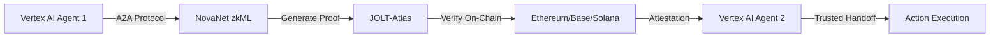

# NovaNet × Google A2A Integration
## Verifiable Agent-to-Agent Protocol with zkML Proofs

<div align="center">
  
  <span style="font-size: 32px; margin: 0 20px;">×</span>
  
  
  <h3>Making AI Agents Trustworthy Through Cryptographic Verification</h3>
</div>

## 🎯 The Problem Google A2A Solves... And The One It Doesn't

Google's Agent2Agent (A2A) protocol enables seamless communication between AI agents across different frameworks. But **how do you trust what an agent claims it did?**

### Current A2A Limitations
```javascript
// Current A2A: Agents can claim anything
agent1.send({
  message: "I analyzed 1M records",
  decision: "approve_loan",
  confidence: 0.95
});
// ❌ No proof this actually happened
// ❌ No verification of decision logic
// ❌ No audit trail for compliance
```

### With NovaNet zkML Integration
```javascript
// NovaNet-Enhanced A2A: Cryptographically proven decisions
agent1.send({
  message: "I analyzed 1M records",
  decision: "approve_loan",
  confidence: 0.95,
  zkProof: "0x4a3f2b1c...",  // Verifiable proof
  onChainTx: "0x5bd91b01..."  // Permanent record
});
// ✅ Cryptographic proof of analysis
// ✅ Verifiable decision logic
// ✅ Immutable audit trail
```

## 🚀 Integration Architecture



## 💡 Key Use Cases for Google Cloud Customers

### 1. Financial Services Compliance
```python
# Gemini analyzes loan application
decision = gemini_agent.analyze_loan(application)

# Generate zkML proof of decision
proof = novanet.prove_llm_decision({
    "model": "gemini-1.5-pro",
    "decision": decision.outcome,
    "confidence": decision.confidence,
    "parameters_checked": 14,
    "compliance": ["FCRA", "ECOA", "Reg B"]
})

# Pass to next agent with proof
approval_agent.process({
    "decision": decision,
    "zkProof": proof.hash,
    "verifier": "0xDCBbFCDE276cBEf449D8Fc35FFe5f51cf7dD9944"
})
```

### 2. Healthcare AI Decisions
```python
# Medical diagnosis agent
diagnosis = vertex_medical_agent.analyze_symptoms(patient_data)

# Prove HIPAA compliance without revealing PHI
proof = novanet.prove_medical_decision({
    "decision": diagnosis.recommendation,
    "data_points": len(patient_data),
    "hipaa_compliant": True,
    "pii_exposed": False
})

# Verifiable handoff to treatment agent
treatment_agent.receive_verified({
    "diagnosis": diagnosis,
    "proof": proof,
    "chain": "avalanche"  # Healthcare-focused chain
})
```

### 3. Multi-Cloud Agent Orchestration
```python
# Google Vertex AI → AWS Bedrock → Azure OpenAI
workflow = MultiCloudAgentWorkflow()

# Each handoff is verifiable
step1 = vertex_agent.process(data)
proof1 = novanet.prove_agent_execution(step1)

step2 = bedrock_agent.process(step1, proof=proof1)
proof2 = novanet.prove_agent_execution(step2)

step3 = azure_agent.process(step2, proof=proof2)
proof3 = novanet.prove_agent_execution(step3)

# Complete audit trail on-chain
audit = novanet.get_workflow_attestations([proof1, proof2, proof3])
```

## 🛠️ Technical Implementation

### Step 1: Install NovaNet A2A Adapter
```bash
pip install novanet-a2a-adapter
npm install @novanet/google-a2a
```

### Step 2: Enhanced ADK Agent with zkML
```python
from adk import Agent
from novanet import zkMLProver

class VerifiableAgent(Agent):
    def __init__(self):
        super().__init__()
        self.prover = zkMLProver(
            framework="JOLT-Atlas",
            chain="ethereum-sepolia"
        )
    
    async def process_with_proof(self, request):
        # Standard ADK processing
        result = await self.process(request)
        
        # Generate zkML proof
        proof = await self.prover.prove_decision({
            "model": self.model_name,
            "input_hash": hash(request),
            "output": result,
            "parameters": self.get_parameters(),
            "timestamp": time.now()
        })
        
        # Return with proof
        return {
            **result,
            "zkProof": proof.hash,
            "verifier": proof.contract_address,
            "tx": proof.transaction_hash
        }
```

### Step 3: A2A Protocol Extension
```javascript
// Extend A2A message format
const A2AMessage = {
  // Standard A2A fields
  id: "msg-123",
  from: "agent-1",
  to: "agent-2",
  content: {...},
  
  // NovaNet verification fields
  verification: {
    zkProof: "0x4a3f2b1c...",
    proofType: "JOLT-Atlas",
    verifierContract: "0xDCBb...",
    chain: "ethereum",
    txHash: "0x5bd91b01...",
    gasUsed: 344175,
    timestamp: 1735501234
  }
};
```

### Step 4: Vertex AI Agent Engine Deployment
```yaml
# agent-config.yaml
apiVersion: agents.google.com/v1
kind: Agent
metadata:
  name: verifiable-loan-processor
spec:
  runtime: vertex-ai-engine
  model: gemini-1.5-pro
  extensions:
    - novanet-zkml
  verification:
    enabled: true
    chains:
      - ethereum
      - base
      - avalanche
    proofTypes:
      - llm-decision
      - kyc-compliance
      - data-integrity
```

## 📊 Performance Metrics

| Operation | Standard A2A | NovaNet-Enhanced A2A |
|-----------|--------------|---------------------|
| Message Pass | 50ms | 50ms + 500ms proof |
| Trust Level | Claimed | Cryptographic |
| Audit Trail | Logs | Blockchain |
| Compliance | Self-reported | Verifiable |
| Cost | $0.001 | $0.001 + $0.0005 gas |

## 🔥 Developer Benefits

### For Google Cloud Developers
- **Zero Trust Architecture**: Every agent decision is verifiable
- **Compliance Ready**: Built-in audit trails for regulated industries
- **Multi-Cloud Compatible**: Verify across AWS, Azure, GCP
- **ADK Native**: Works with existing Agent Development Kit

### For Enterprise Customers
- **Reduced Liability**: Cryptographic proof of AI decisions
- **Regulatory Compliance**: Immutable audit trails
- **Vendor Independence**: Verification across any cloud
- **Cost Efficiency**: Only ~$0.0005 per verification

## 🎮 Live Demo

### Try It Now (Colab Notebook)
```python
# Run in Google Colab
!pip install novanet-a2a google-adk

from novanet.google import VerifiableADKAgent

# Create verifiable agent
agent = VerifiableADKAgent(
    model="gemini-1.5-flash",
    verification=True
)

# Process with automatic proof generation
result = agent.process_verified(
    "Analyze this loan application and provide decision",
    prove_decision=True,
    chain="ethereum"
)

print(f"Decision: {result.decision}")
print(f"Proof: {result.zkProof}")
print(f"Verify at: https://sepolia.etherscan.io/tx/{result.txHash}")
```

## 🏆 Why Google Should Partner with NovaNet

### 1. **First Mover Advantage**
Be the first cloud provider with cryptographically verifiable AI agents

### 2. **Enterprise Differentiation**
- AWS has Bedrock
- Azure has Copilot
- **Google has Verifiable Agents**

### 3. **Regulatory Moat**
Only solution that meets upcoming EU AI Act requirements for high-risk AI systems

### 4. **Developer Ecosystem**
- 150+ A2A partners would benefit
- Natural extension of ADK
- Compatible with Agent Garden samples

### 5. **Revenue Opportunity**
- New SKU: "Vertex AI Verified"
- Premium pricing for regulated industries
- Transaction fees from verification

## 📈 Adoption Strategy

### Phase 1: Developer Preview (Q1 2025)
- Colab notebooks with examples
- ADK extension package
- 1000 free verifications

### Phase 2: Agent Garden Integration (Q2 2025)
- Pre-built verifiable agents
- Industry templates (finance, healthcare, legal)
- Marketplace for verified agents

### Phase 3: Enterprise GA (Q3 2025)
- SLA for verification latency
- Multi-region deployment
- SOC2 compliance

## 🤝 Partnership Proposal

### What NovaNet Provides
- zkML proof generation (JOLT-Atlas)
- Multi-chain verification contracts
- ADK integration package
- Developer documentation

### What Google Provides
- Agent Engine runtime support
- Cloud Marketplace listing
- Go-to-market collaboration
- Developer relations

## 📞 Next Steps

1. **Technical Workshop**: 2-hour session with Google A2A team
2. **Proof of Concept**: Verifiable Gemini agent for loan processing
3. **Developer Preview**: Launch at Google I/O 2025
4. **Partnership Announcement**: Joint blog post

## 📚 Resources

- **NovaNet Docs**: [github.com/novanet/google-a2a](https://github.com/novanet/google-a2a)
- **Live Demo**: [novanet.dev/google-demo](https://novanet.dev/google-demo)
- **Colab Notebook**: [colab.research.google.com/novanet-adk](https://colab.research.google.com/novanet-adk)
- **Discord**: [discord.gg/novanet-google](https://discord.gg/novanet-google)

## 💬 Contact

**For Google Cloud Team**
- Technical: integrations@novanet.xyz
- Partnership: bd@novanet.xyz
- Demo Request: Schedule at [calendly.com/novanet/google](https://calendly.com/novanet/google)

---

*"Making AI Agents Trustworthy, One Proof at a Time"*

**NovaNet** - The Verification Layer for Agent2Agent Protocol