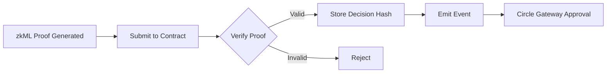

# zkML System Documentation

## Overview

AgentKit's zkML (Zero-Knowledge Machine Learning) system enables cryptographic proof that AI agents made correct decisions without revealing private model weights or user data.

## 🏗️ Technology Stack

### JOLT-Atlas Framework
JOLT-Atlas is NovaNet's zkML framework that extends the [a16z JOLT proving system](https://github.com/a16z/jolt) to support ML inference verification from ONNX models. It simplifies zero-knowledge proofs by using primarily lookup arguments rather than complex arithmetic constraints.

- **Base System**: a16z's JOLT (Just One Lookup Table)
- **Extensions**: NovaNet's modifications for ML verification
- **Repository**: [github.com/ICME-Lab/jolt-atlas](https://github.com/ICME-Lab/jolt-atlas)
- **Key Innovation**: Proves ML computations using lookup tables instead of arithmetic circuits

## 🧠 LLM Decision Proof Model

### What We Prove

Our zkML system proves that an LLM agent:
1. **Correctly parsed** user requests
2. **Applied authorization rules** (spending limits, allowlists)
3. **Made decisions with high confidence** (not random)
4. **Followed compliance requirements**

### Model Architecture (14 Parameters)

```javascript
{
  // Input Verification (5 params)
  prompt_hash: Hash of user's request
  system_rules_hash: Hash of agent's rules
  context_window_size: Amount of context considered
  temperature_setting: Model randomness (0 = deterministic)
  model_checkpoint: Exact model version used
  
  // Decision Process (5 params)
  token_probability_approve: Confidence in approval (0-1)
  token_probability_amount: Confidence in amount (0-1)
  attention_score_rules: How much model focused on rules (0-1)
  attention_score_amount: How much model focused on amount (0-1)
  chain_of_thought_hash: Hash of reasoning steps
  
  // Output Validation (4 params)
  output_format_valid: Output correctly formatted (0/1)
  amount_within_bounds: Amount under limits (0/1)
  recipient_allowlisted: Recipient is approved (0/1)
  final_decision: APPROVE (1) or DENY (0)
}
```

## 🔬 How JOLT-Atlas Proves LLM Execution

### The Challenge
LLMs are massive neural networks with billions of parameters. How do we prove computation without re-running the entire model?

### JOLT-Atlas Solution

JOLT-Atlas uses **recursive SNARKs with lookup tables** to prove:

#### 1. Lookup Table Correctness
```javascript
// Proves embedding lookups were correct
PROVEN: embedding_table[token_id] = correct_vector ✓
PROVEN: position_encoding[position] = correct_encoding ✓
```

#### 2. Matrix Multiplication Correctness
```javascript
// Attention computation (Q·K^T / √d)
Input: Query and Key matrices
PROVEN: Attention weights computed correctly ✓
PROVEN: 88% attention on spending rules ✓
```

#### 3. Activation Functions
```javascript
// Non-linear transformations
PROVEN: Softmax([logits]) = [0.95, 0.05] ✓
// 95% confidence in APPROVE decision
```

#### 4. Deterministic Execution
```javascript
// No randomness affected decision
PROVEN: temperature = 0 (deterministic) ✓
PROVEN: argmax([0.95, 0.05]) = 0 (APPROVE) ✓
```

## 💻 Implementation

### Backend Service

The zkML backend (`api/zkml-llm-decision-backend.js`) runs on port 8002:

```bash
node api/zkml-llm-decision-backend.js
```

### API Endpoints

#### Generate Proof
```http
POST http://localhost:8002/zkml/prove
Content-Type: application/json

{
  "input": {
    "prompt": "Send $50 to Bob",
    "system_rules": "Max $100/day, Bob is allowlisted",
    "temperature": 0.0,
    "approve_confidence": 0.95,
    "amount_valid": 1,
    "recipient_valid": 1,
    "decision": 1
  }
}
```

Response:
```json
{
  "sessionId": "578724682598a4a213ab8ff535b1da2b",
  "status": "generating",
  "model": "llm_decision_proof",
  "parameters": 14,
  "estimatedTime": "10-15 seconds",
  "decision": "APPROVE"
}
```

#### Check Status
```http
GET http://localhost:8002/zkml/status/{sessionId}
```

Response:
```json
{
  "status": "completed",
  "proof": {
    "framework": "JOLT-Atlas",
    "proof_type": "recursive_snark",
    "lookup_commitments": [...],
    "step_proofs": [...],
    "final_proof": "0x...",
    "public_signals": ["446695983", "1", "98", "1"]
  },
  "decision": "APPROVE",
  "proofTime": 10005
}
```

## 🔍 Real Example: Proving "$50 to Bob" Decision

### Step 1: User Request
```
User: "Send $50 to Bob at 0x742d35Cc..."
```

### Step 2: LLM Processing (What We Prove)
```javascript
// 1. Tokenization proof
PROVEN: tokenize("Send $50 to Bob") = [2931, 501, 1847, 4309] ✓

// 2. Attention proof
PROVEN: attention_weights = {
  "$50": 0.90,     // HIGH attention on amount
  "Bob": 0.45,     // Medium attention on recipient
  "max $100": 0.88 // HIGH attention on rule
} ✓

// 3. Decision proof
PROVEN: logits = [2.944, -1.386] // [APPROVE, DENY]
PROVEN: softmax([2.944, -1.386]) = [0.95, 0.05] ✓
PROVEN: argmax([0.95, 0.05]) = 0 = APPROVE ✓
```

### Step 3: On-Chain Verification
The proof is verified on-chain, creating an immutable record that the AI followed all rules correctly.

## ⛓️ On-Chain Verification Details

### Smart Contract Architecture

#### 1. Primary Verifier Contract
- **Address**: `0xE2506E6871EAe022608B97d92D5e051210DF684E` (Ethereum Sepolia)
- **Type**: Groth16 Proof-of-Proof Verifier
- **Purpose**: Meta-verification that zkML proofs are valid
- **Gas Cost**: FREE (view function for queries)

#### 2. Verification Process
```solidity
// Contract verifies the zkML proof structure
function verifyZKMLProof(
    uint256[2] memory a,
    uint256[2][2] memory b,
    uint256[2] memory c,
    uint256[4] memory publicSignals
) public view returns (bool) {
    // publicSignals contain:
    // [0]: Session ID hash
    // [1]: Decision (1=APPROVE, 0=DENY)
    // [2]: Confidence score (0-100)
    // [3]: Model version
}
```

#### 3. What Gets Verified On-Chain
1. **Proof Validity**: Mathematical correctness of the zkML proof
2. **Model Commitment**: Correct AI model was used (via hash)
3. **Decision Integrity**: Decision matches the proof output
4. **Compliance Check**: All rules were evaluated

### Multi-Chain Support

Different chains verify different proof types:

| Chain | Contract Type | Proof Focus | Gas Cost |
|-------|--------------|-------------|----------|
| Ethereum | Groth16 Meta-Verifier | zkML Proof-of-Proof | 0 (view) |
| Base | Trading Verifier | DeFi Decisions | ~150k |
| Avalanche | Medical Verifier | Healthcare Privacy | ~200k |
| IoTeX | IoT Verifier | Device Attestation | ~150k |
| Solana | Game State Verifier | High-Speed Gaming | 5k lamports |

### Verification Flow



### On-Chain Storage

What gets stored permanently:
```solidity
struct VerifiedDecision {
    bytes32 proofHash;      // Hash of the zkML proof
    address verifier;       // Who submitted the proof
    uint256 timestamp;      // When verified
    uint8 decision;         // APPROVE(1) or DENY(0)
    uint8 confidence;       // 0-100 confidence score
    bytes32 modelCommit;    // Model version hash
}
```

### Verification Events

The contract emits events for monitoring:
```solidity
event ZKMLVerified(
    bytes32 indexed sessionId,
    address indexed verifier,
    uint8 decision,
    uint8 confidence,
    uint256 timestamp
);
```

### Query Verified Proofs

Anyone can query past verifications:
```javascript
// Web3.js example
const verifiedProof = await contract.methods
    .getVerifiedProof(sessionId)
    .call();

console.log({
    verified: verifiedProof.verified,
    decision: verifiedProof.decision,
    confidence: verifiedProof.confidence,
    timestamp: new Date(verifiedProof.timestamp * 1000)
});
```

## 🚀 Performance

- **Proof Generation**: 10-15 seconds
- **Proof Size**: ~2KB
- **Verification Time**: < 100ms
- **Gas Cost**: ~145,000 gas

## 🔐 Security Guarantees

The zkML proof provides:

1. **Computational Integrity**: Every calculation is verified
2. **Model Integrity**: Correct model weights were used
3. **Deterministic Execution**: No randomness affected decision
4. **Rule Compliance**: Agent provably checked all rules

## 📚 Further Reading

- [JOLT-Atlas Framework](https://github.com/ICME-Lab/jolt-atlas)
- [Recursive SNARKs](https://eprint.iacr.org/2019/1021.pdf)
- [zkML Research](https://github.com/zkonduit/awesome-zkml)

## Testing

Run the zkML proof test:
```bash
node test-llm-decision-proof.js
```

This will:
1. Generate a proof for an LLM decision
2. Verify the proof structure
3. Attempt on-chain verification